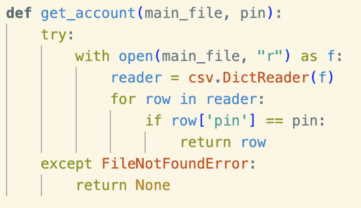
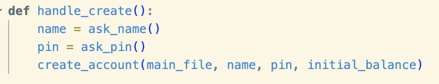
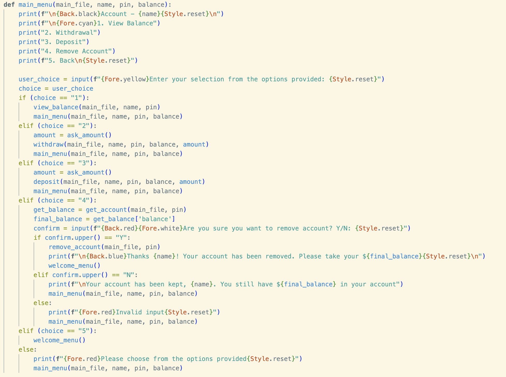
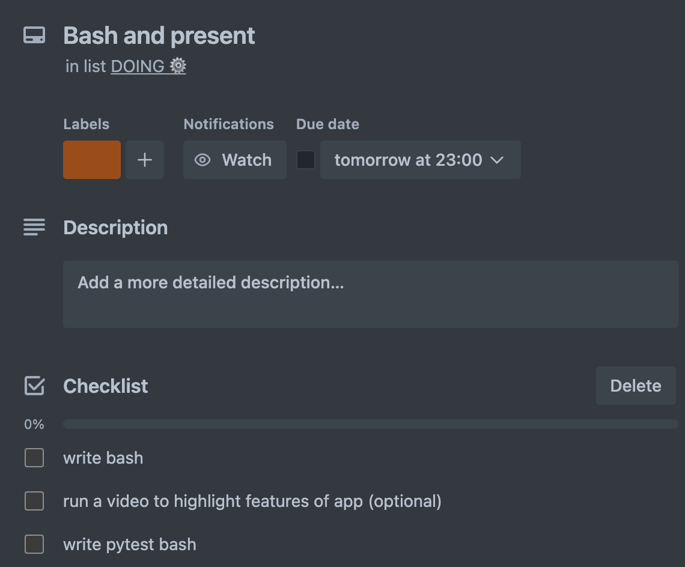

# T1A3 Terminal Application

## Terminal Bank

### Wade Venz
Howdy! Welcome to the Terminal Bank. A simple application where users interacting with the terminal will be able to engage in a virtual pseudo-bank, creating an account, withrawing and depositing arbitrary imaginary funds running a total balance. 

[**GitHub**](https://github.com/wadevenz/FEB24-T1A3-Terminal_Application)

### Functionality
The basic functionality of this application revolves around the creation of a central csv file that initialises with three headers: name, pin and balance. User inputs will populate these fields as lists, and will be called upon for features listed below. 

#### Small Functions
There are a few smaller functions utilised throughout this application that check conditions, assign variables and return data to enable the main functions to work. Ill quickly discuss these as they will be refeered to later. 

##### ask_name

The function asks the user to input a string and assigns the input to the object 'name'.

##### ask_pin

This function also asks user to input a 4 digit pin. The input is put through two conditions with a single if statement to check whether the input contains only numbers with the isdigit() method and also if the input is only 4 digits in length with the method len(pin). If conditions are met or True, it returns the pin as a string, however if either of the above conditions are False, it prints an error message and calls the welcome menu.

##### ask_amount 

The amount is assigned to the input asking for the user to specify a value amount. Using 'int' method to encompass input, the amount will be returned an integer. Before it is returned however, it is put through a conditional if statement to check whether the user input is above 0. A ValueError exception is raised if input is unexpected, such as alphabet character that cannot be converted to integer. A TypeError is also raised in the other functions utilising 'ask_amount' when the incorrect Value is inputted including an amount that is less than 0. 

##### get_account

This function uses the parameters of the csv file and pin returned from user input. The function works by opening the file in a 'read' mode. Utilising csv package, the function is able to read the csv file as a dictionary using "Dictreader". Then through a for loop, iterates through each line of the csv file, checking for the 'value' that matches the pin 'key'. If the pin 'key' finds a match it returns the corresponding line in the csv file. This row can then assigned to the 'current_user' object in the menu for use in other functions. This function also uses a try/except to raise an exception for the FileNotFoundError, if the file trying to be read does not exist. This error was identified in testing. The function returns "None" in the case of this error. 

##### handle_create

Simply uses the inputs from 'ask_name' and 'ask_pin' and assigns the returns to their respective variables. Then calls the 'create_account' feature discussed below with variables set as parameters, including the 'initial_balance' initialised at '100'. 

##### handle_access

A simple intermediary function, called from the Access Account menu option, that consolidates the 'ask_pin' function, runs through the 'get_account' function to ascertain whether the inputted pin from the user exists within the csv file. If it does not, an error message displaying "Incorrect PIN" is printed. If the 'get_account" function is run successfully, the 'current_user' object containing the return from 'get_account' is set as the parameters to the 'main_menu' alongside the file name. The 'main_menu' function is then called containing the relevant data of the user for further functions. 

#### Menus
##### Welcome Menu

The opening menu is called first. It prints 3 options and asks for user input to select 1 of the 3 options via inputting number as a string. Then by using conditional statements if, elif and else, comparisons are made with the user input, returned as the object 'user_selection'. Functions are called depending on which condition is True, and if no option is satisfied the 'welcome_menu' is recalled, with a print statement requesting a valid input from the options. I must admit that it was desired to utilise 'while' loops for my menus, to show that while a certain condition was met, e.g. 'user_seletion' did not meet the condition of 'exit', that the'welcome_menu' would be recalled. However, my inexperience potentially came through and in my final application, I was only able to utilise recursion to recall the menu function. This enabled a smooth experience that worked, however potentially less efficient. 

##### Main Menu

The only significant difference in functionality from the 'welcome_menu' is the "Remove Account" option. Within this option in the menu, a further user input has been requested to confirm account removal. Conditional statements are utilised to compare input with either "Y" or "N". The method of .upper() is used to correctly make comparison. Depending on the user input, the remove account function is called, and user is sent back to 'welcome_menu', or 'main_menu' is recursively called. Print statements accompany both options and an error message is also printed when the user input matches neither "Y" or "N". This also uses reursion to all 'main_menu'.

#### Return and Exit
From the menu in an accessed account, one conditional from the menu is "Back". If the user input conditional is met for this option, the "welcome_menu" is immediately called. The "Exit" option from this menu, will print a final statement before exiting the program if the user selects this option. 

### Features

#### Create Account

In the initial menu, it will enable the user to create an account. The user will input a name and a unique 4 digit PIN which will be stored in a csv file. A bonus of "$100" is also added to balance with a print message to indicate this has been done. 

##### How it works
It is important for functionality that each pin is unique so that appropriate data can be collected and assigned to current user. Therefore the first step of the 'create_account' is to utilise the 'get_account' funtion to check whether a row with the same pin value already exists. If 'get_account' does not return 'None' then it prints a message stating a unique pin is required.If 'get_account' returns 'None' then an account can be created with the variables given by opening the file using the 'with' statement in 'append' mode. The variables are then appended in order to the csv, assigned to their appropriate indices. The with statement is useful for opening files as it enables a file to be closed automatically. 

#### Access Account
The same initial menu also allows users to access accounts already created with the use of PIN the user has self determined. This option will open a secondary menu from which the other features operate. 

##### How it works
Reusing the 'ask_pin' function from before, the users 'pin' input is then run through the 'get_account' function again. If the 'get_account' function does not return 'None', the row it returns is then assigned to the varibale 'current_user'. Each key from the dictionary of the row in 'current_user' is the assigned as parameters to the 'main_menu' alongside the file name. Because the 'main_menu' is accessed with the information relating to user from the file, user pin is no longer required until returning to initial 'welcome_menu'.

#### View Balance

This displays the current users remaining balance. 

##### How it works
Utilising the 'get_account' function, the balance is assigned to a variable and the printed to screen. 

#### Withdraw

User is able to input a value amount which is subtracted from running balance. A printed message is then displayed informing user of transaction. 

##### How it works
A variable app_balance is initialised to a list. The main file is then opened from the 'with' command into a read mode. "reader" variable is set to to reader method imported from the csv package. Then utilisng a for loop to iterate through every line or 'row' in the file, a condition is set to make comparison with the 'pin' column in rown index 1. If pin does not equal or returns false for that row, the entire row is appended to the list 'app_balance'. If the pin comparison equates to True (indicated from the else condition), the balance in row index 2 of the line is made to an integer for use in math calculation. A condition is asked if the amount is less than or equal to the balance set in the function parameter, and if True, the amount is subtracted from the balance and set to the variable 'new_balance'. The variable 'app_balance' is then appended with the 'name', 'pin' and 'new_balance' variables and a print statement is diplayed. If the 'amount less than balance' condition is False, then the row is appended as it is read to the 'app_balance' list and a print statement is displayed. The funtion is completed by opening the file in 'write' mode and writing over the preexisting data with the newly created 'app_balance' list. As mentioned earlier in 'ask_amount', this function also uses try/exception to indentify a TypeError for incorrect amount input. 

#### Deposit.

User is able to input a value amount which is added to running balance. A printed message is then displayed informing user of transaction.

##### How it works
How this function works is very similar to the withdraw function above, however no condition is neccessary for checking whether the amount value is less than the balance. Also rather than a subtraction, an addition is made to calculate the new balance. 

#### Remove Account

This last feature is similar to the previous as it initalises a list to 'new_file' and opens the main file in 'read' mode. Iterating through each'row'using a for loop, the if pin does not equal the 'row' index 1 condition for each iteration, appending the list in the variable 'new_file'. If the condtion is False or in other words the pin equals index 1 of the 'row', the balance or index 2 of the 'row' is returned. This will be set to a variable in the menu for a print statement to be displayed to the user for 'final_balance'.

### Code Style Guidelines
[PEP 8](https://peps.python.org/pep-0008/#introduction) was the style guide for this assessment. 
Some of the notable styles that were attempted to be adhered to rigidly were:

    - lower case for function names seperated by underscores e.g create_account
    - appropriate indentation
    - import on separate lines with appropriate grouping
    - avoiding improper variable and object naming
    - wrapped to achieve max 79 characters per line

(5)
### Getting Started
This application has been created, executed and tested with macOS. If using a Windows operating system, please ensure all operations are run in WSL.

Once the application has been cloned from the Git repository (link provided above), you will need to run this command in your terminal:

`chmod +x src/run.sh`

That command will make the bash script an executable file which will allow you to run the bash script by putting the following command in your terminal:

`./src/run.sh`

This will check that python is installed, create a virtual environment and then install all packages and dependencies required for application function. The application will then run, voila!. 

### Dependencies
The code required for application is located in the 'src' folder of the repository. As mentioned above, this application utilises Python3, which the script will do an installation check before running. The dependencies that will be installed once a Vitrual environment has been created will be:

colored==2.2.4
exceptiongroup==1.2.1
iniconfig==2.0.0
packaging==24.0
pluggy==1.5.0
pytest==8.2.0
tomli==2.0.1

(Ref: 1,2,3,4)
#### Testing
While pretty extensive, and regular user testing was one throughout the coding process, a package called[pytest](https://docs.pytest.org/en/8.2.x/) was utilised for unittest. A seperate file called 'test_bank' contains these tests. For these tests to operate, the commented out returns on the 'withdraw' and 'deposit' functions from within 'bank_functions' file, will need to be restored. The command `pytest` in terminal will then execute a test. 

### User Guide
A handy help guide to run beginners through the usage of my application. 

[User Guide](docs/user_guide/user_guide.md)

### Implementation
A link to Trello Board, which tracks progress through application development.

[**Trello Board**](https://trello.com/invite/b/KILIAHaw/ATTIb8887dfc104ceaad83abb75cca741b9bAF9170F3/terminal-app)

Prioritisation was done via color labels where red was highest priority and blue to do when able. 

### References

1. Python Software Foundation, 2001, csv - CSV File Reading and Writing, https://docs.python.org/3/library/csv.html

2. Krekel, H & pytest Dev team, 2015, pytest: helps you write better programs, https://docs.pytest.org/en/8.2.x/

3. Python Software Foundation, 2024, o.s. path - Common pathname manipulations, accesssed April 2024, https://docs.python.org/3/library/os.path.html

4. Zlatanidis D 2023, colored, GitLab, accessed April 2024, https://dslackw.gitlab.io/colored/

5. van Rossum G, Warsaw B, Coghlan A, 2001, PEP 8 - Style Guide for Python Code, accessed April 2024, https://peps.python.org/pep-0008/#introduction